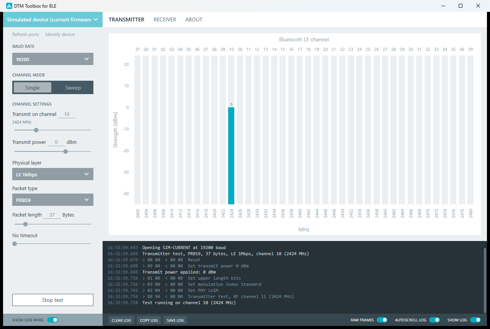
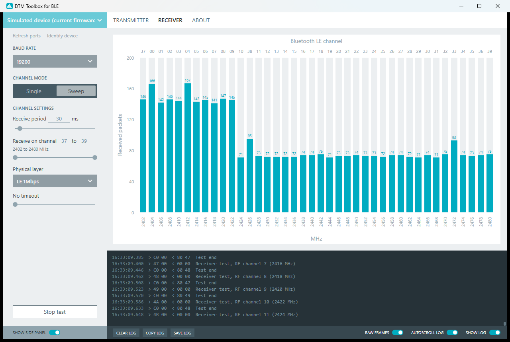

# DTM Toolbox for BLE

Desktop application for Bluetooth LE Direct Test Mode (DTM) over the 2-wire UART interface (Bluetooth Core Specification, Vol 6, Part F). It drives a device under test from a PC serial port: transmitter and receiver tests, single channel or channel sweep, with a live per-channel chart and a log of every frame exchanged.

Runs on Windows 7 SP1 and later. Distributed as an installer and as a portable executable.

## Features

- Transmitter test: packet type (PRBS9, 11110000, 10101010, and 11111111 on the LE Coded PHY), payload length, PHY (LE 1M, LE 2M, LE Coded S2, LE Coded S8) and transmit power, with the level the device applied shown in the chart.
- Receiver test: packets received per channel, accumulated across sweeps.
- Channel modes: single channel, or sweep over a channel range with a configurable time per channel. Optional test timeout.
- Transmit power on current and on older firmware: the specification setup command `0x09` is tried first. Nordic nRF5x firmware that predates Bluetooth 5.2 gets the vendor command, with the nearest level its radio accepts.
- Vendor extension profiles: generic (specification only) or Nordic nRF5x (constant carrier, vendor transmit power).
- Serial port list taken from Windows, with friendly names and automatic refresh on plug and unplug. No vendor tool or driver detection in between.
- Device identification: supported features and maximum packet sizes read from the device.
- Log with timestamps and, on request, the raw command and event bytes. Lines can be selected and copied, and the log exported to a text file.

## Requirements

- Windows 7 SP1 or later, x86 or x64.
- .NET Framework 4.6.2 or later. Windows 8.1, 10 and 11 ship with a compatible version. The installer carries the .NET Framework 4.8 offline installer and runs it only on a machine that needs it.
- A device running DTM firmware with the 2-wire UART interface, reachable through a serial port (USB-to-serial adapter or on-board bridge). Default link settings: 19200 baud, 8N1, no flow control.

## Download and install

Releases page: <https://github.com/felipedts/dtm-toolbox-for-ble/releases>

| File | Use |
|---|---|
| `DtmToolbox-<version>-setup.exe` | Installer. Works offline. Installs for all users, or for the current user without administrator rights |
| `DtmToolbox-<version>-portable.zip` | The executable alone. Unzip and run from any folder |
| `SHA256SUMS.txt` | Checksums of the two files |

The files are not digitally signed. Windows SmartScreen shows "Windows protected your PC" the first time: click "More info" and then "Run anyway".

On Windows 7 SP1 without .NET Framework 4.6.2 or later, the .NET Framework 4.8 installer needs the updates KB4474419 and KB4490628 (SHA-2 code signing support) installed first.

Usage: [docs/quick-start.md](docs/quick-start.md). Protocol as implemented: [docs/protocol.md](docs/protocol.md).

## Command line

`DtmToolbox.exe --simulate` adds two simulated devices to the port list, one with current and one with older firmware behavior, and leaves the stored settings untouched. They run the whole application without hardware.

## Building from source

Requires the .NET SDK 8.0 on Windows. The .NET Framework 4.6.2 reference assemblies are restored automatically.

    dotnet build -c Release
    dotnet test -c Release

Output: `src\DtmToolbox\bin\Release\net462\DtmToolbox.exe`, a single file with no other dependency than the .NET Framework.

The release files are packed by `build\build.ps1` into `artifacts\`. The installer needs Inno Setup 6.7.3 (`build\install-innosetup.ps1`) and the .NET Framework 4.8 offline installer, which `build\fetch-redist.ps1` downloads from Microsoft and checks for a valid Microsoft signature.

## License

MIT. See [LICENSE](LICENSE).
